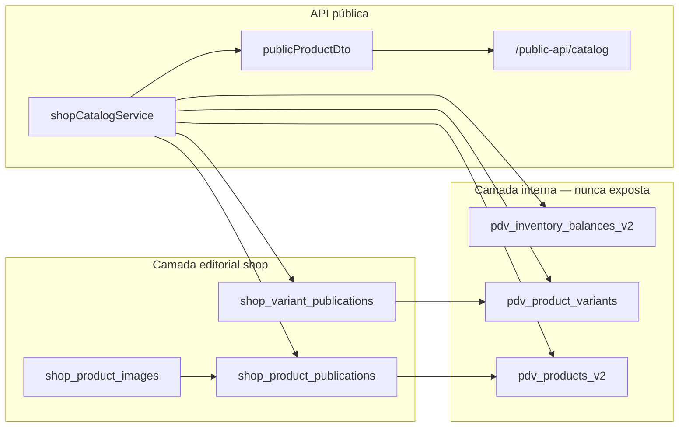
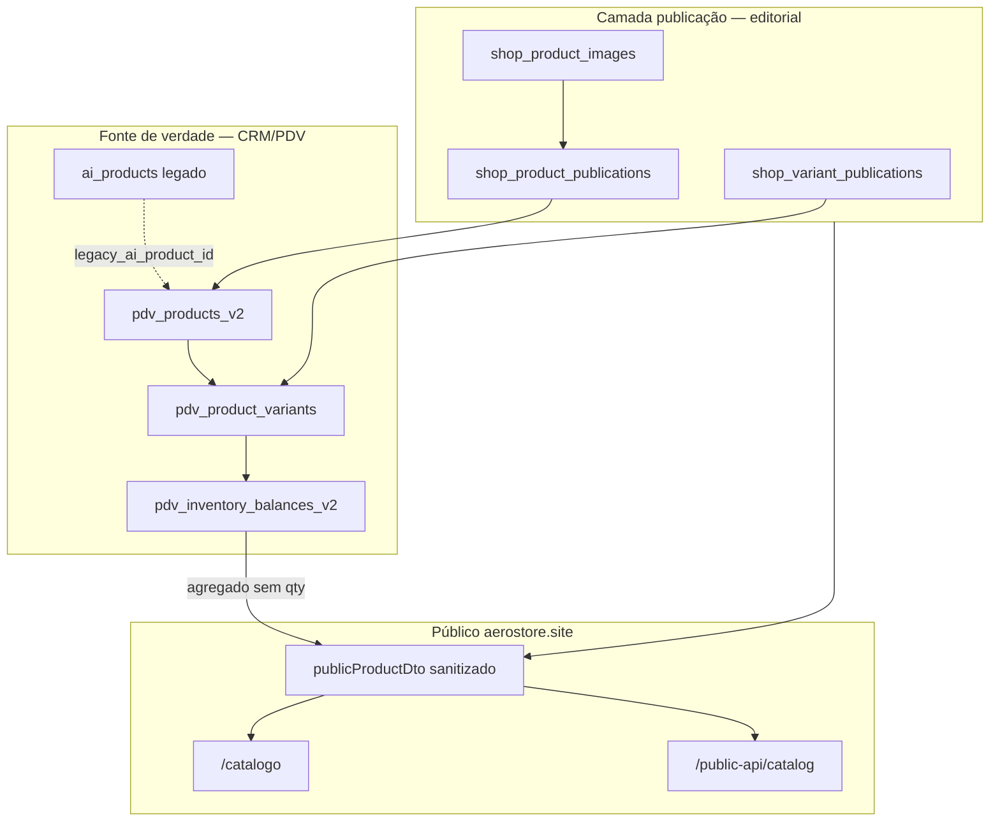

# Fase 2.6 — Investigação: catálogo integrado CRM/PDV + camada de publicação

**Modo:** read-only · **sem migration, sem commit, sem deploy**  
**Data:** 2026-07-10  
**Objetivo:** definir como o e-commerce deixa de depender de JSON manual e passa a usar o cadastro real do CRM/PDV como fonte de verdade, com uma única camada editorial de publicação.

---

## Resumo executivo

Hoje o shop público lê **`pilot-publications.json`** (`shopCatalogService.js`, flag `use_pilot_json: true`). O cadastro operacional real vive em **`pdv_products_v2` + `pdv_product_variants` + `pdv_inventory_balances_v2`** (SQLite em `db.js`), com legado em **`ai_products`**.

A direção correta — já aprovada em `ecommerce-architecture.md` — é **Publication Layer + Order Domain**:

- **CRM/PDV** = fonte de verdade para produto, grade, preço e estoque físico.
- **Shop** = projeção intencional: só aparece no site o que estiver **publicado** em `shop_product_publications`.
- **API pública** = DTO sanitizado (`publicProductDto.js`), nunca expõe SKU, Tiny ID, custo ou saldo por loja.

Não é necessário duplicar cadastro em JSON. O intake manual (`real-catalog-intake.template.json`) deixa de ser o destino final; vira ferramenta temporária ou é substituído por UI de publicação.

---

## 1. Onde estão os produtos reais

### Camada oficial (venda PDV) — **usar esta**

| Artefato | Caminho | Papel |
|----------|---------|-------|
| Schema SQLite | `db.js` → `initializeDatabase()` | Cria/evolui tabelas |
| Produto pai | `pdv_products_v2` | Nome, tipo, status, preço base, `base_sku` |
| Variação vendável | `pdv_product_variants` | SKU, barcode, cor/tamanho, preço por variação |
| Saldo por loja | `pdv_inventory_balances_v2` | `available_qty`, `reserved_qty` por `variant_id + store_id` |
| Movimentos | `pdv_inventory_movements_v2` | Auditoria de baixa/reserva |
| Serviço CRUD | `modules/pdv/products/pdvSimpleProductService.js` | Criação/edição normalizada |
| Gestão catálogo | `modules/pdv/products/pdvProductManagementService.js` | `listProductManagementCatalog()` |
| Busca venda | `modules/pdv/services/pdvOperationalService.js` | `searchProductsDetailed()`, `searchNormalizedProductParents()` |
| Rotas internas | `server.js`, `modules/pdv/routes/pdvOperationalRoutes.js` | `/api/products`, `/api/pdv/operational/search/products` |

### Camada legado CRM — **não usar como fonte web direta**

| Artefato | Tabela | Observação |
|----------|--------|------------|
| Catálogo IA/CRM antigo | `ai_products` | Contém `tiny_id`, `sku`, `cost_price`, `use_in_pos`, `use_in_ai` |
| Link | `pdv_products_v2.legacy_ai_product_id` | Ponte para mídia/preço promocional legado |

`ecommerce-architecture.md` define explicitamente: **não** reutilizar `ai_products` como publicação web.

### Camada operacional JSON — **projeção, não fonte editorial**

| Artefato | Caminho | Papel |
|----------|---------|-------|
| Inventário operacional | `data/pdv/inventory/inventory.json` | Compatibilidade frente de caixa |
| Serviço | `modules/pdv/inventory/pdvInventoryService.js` | Sincroniza com normalizado |

### Camada shop atual — **piloto temporário**

| Artefato | Caminho | Papel |
|----------|---------|-------|
| Catálogo público | `modules/shop/config/pilot-publications.json` | 10 produtos provisórios |
| Serviço | `modules/shop/services/shopCatalogService.js` | Lê JSON se `use_pilot_json: true` |
| Estoque shop | `modules/shop/services/shopStockService.js` | **Stub** — Fase 7 |

---

## 2. Variações, cores e tamanhos

**Tabela:** `pdv_product_variants`

| Coluna | Conteúdo |
|--------|----------|
| `id` | ID da variação (TEXT, ex. `VAR_...`) |
| `product_id` | FK → `pdv_products_v2.id` |
| `attributes_json` | JSON com `color`, `size` (parseado em `pdvSimpleProductService.js`) |
| `attribute_key` | Chave única da combinação (ex. `DEFAULT`, `MARINHO|M`) |
| `is_default` | Variação padrão do card |
| `status` | `ativo` \| `bloqueado_para_venda` \| `inativo` |

**Exemplo de leitura (já usada no PDV):**

```javascript
// pdvOperationalService.js — searchNormalizedProductParents
attributes = JSON.parse(row.attributes_json || "{}");
cor: attributes.color
tamanho: attributes.size
```

**Produto simples vs variável:** `pdv_products_v2.product_type` = `simple` | `variable`. Simples usa uma variação `DEFAULT`; variável tem N linhas em `pdv_product_variants`.

---

## 3. Onde está o preço de venda

| Nível | Coluna | Prioridade na venda |
|-------|--------|---------------------|
| Produto pai | `pdv_products_v2.sale_price_cents` | Preço base |
| Variação | `pdv_product_variants.sale_price_cents` | **Sobrescreve** se preenchido |
| Legado CRM | `ai_products.price`, `promotional_price` | Usado hoje na busca PDV como `catalog_price` / `catalog_promotional_price` |

**Regra para shop (proposta):**

```text
price_cents_public = COALESCE(
  shop_variant_publications.public_price_cents,  -- override editorial opcional
  pdv_product_variants.sale_price_cents,
  pdv_products_v2.sale_price_cents
)
```

Preço promocional público (`compare_at_price_cents`) só se houver política comercial explícita — hoje o legado `ai_products.promotional_price` **não** deve vazar direto; precisa decisão + campo editorial ou regra documentada.

---

## 4. Onde está o estoque por loja

**Tabela:** `pdv_inventory_balances_v2`

| Coluna | Significado |
|--------|-------------|
| `variant_id` | Variação |
| `store_id` | Loja (`vila_masc`, `botanico`, `sul` — ver `shop-settings.json`) |
| `available_qty` | Físico |
| `reserved_qty` | Reservado (PDV/reservas futuras shop) |

**Saldo vendável por loja:** `available_qty - reserved_qty` (já calculado em `searchNormalizedProductParents`).

**Pool de fulfillment online** (`modules/shop/config/shop-settings.json`):

```json
"stock_policy": "min_across_stores"
```

**Agregação proposta (não expor número):**

```text
sellable_pool = MIN(available_qty - reserved_qty) entre store_ids do pool
availability_label = in_stock | low_stock | out_of_stock  (threshold = 2)
```

Implementação futura: `shopStockService.computeVariantAvailability()` — hoje retorna `implemented: false`.

---

## 5. Como listar somente produtos vendáveis

### Critérios já usados no PDV operacional

Em `searchNormalizedProductParents` (`pdvOperationalService.js`):

1. `pdv_products_v2.status = 'ativo'`
2. Variação `status = 'ativo'`
3. `sale_enabled = true` quando `(available_qty - reserved_qty) > 0` na loja consultada

Em `pdvSimpleProductService.js` / `pdvSalesService.js` no fechamento de venda:

- Bloqueia `product_status != ativo`
- Bloqueia `variation_status` bloqueado/inativo
- Valida saldo insuficiente

### Critérios propostos para catálogo **público**

| Gate | Onde | Efeito |
|------|------|--------|
| Publicado no site | `shop_product_publications.status = 'published'` | Aparece na vitrine |
| Variação publicada | `shop_variant_publications.status = 'published'` | Aparece na grade pública |
| Produto PDV ativo | `pdv_products_v2.status = 'ativo'` | Mesmo publicado, some se bloqueado internamente |
| Variação PDV ativa | `pdv_product_variants.status = 'ativo'` | Some da grade pública |

**Diferença importante:** no PDV, `sale_enabled` exige estoque > 0. No **catálogo web read-only**, pode-se mostrar produto publicado com `availability: out_of_stock` (sem quantidade) — decisão comercial. A API já suporta os três labels sem expor número.

---

## 6. Como evitar expor dados internos

### Lista proibida (código + contrato)

`modules/shop/dto/publicProductDto.js` → `FORBIDDEN_KEYS`:

`product_id`, `variant_id`, `legacy_ai_product_id`, `tiny_id`, `cost_price_cents`, `sku`, `barcode`, `store_id`, `available_qty`, `reserved_qty`, `margin`, `notes`, `source`, `internal_id`

Reforçado em:

- `docs/architecture/public-api-contracts.md`
- `scripts/shop_public_security_smoke.js`

### Regras de implementação

1. **Nunca** serializar linhas SQL direto na API pública.
2. Montar DTO via `toCatalogListItem` / `toCatalogDetail` após join interno.
3. Rotas internas (`/api/products`, `/api/pdv/*`) bloqueadas no host público (`publicSiteHost.js` + smoke).
4. Imagens internas (`/api/uploads/media/{id}/preview`) **não** usar no público — fotos web em `/shop/assets/...` ou CDN editorial.
5. Estoque: só `in_stock` \| `low_stock` \| `out_of_stock`.

---

## 7. Tabelas futuras (proposta — **não aplicar ainda**)

Já documentadas em `docs/architecture/shop-schema-design.md`. Extensão recomendada para Fase 2.6+:

### A) `shop_product_publications` (gate produto)

Liga `product_id` → `pdv_products_v2.id`. Campos editoriais: slug, título, descrição, categoria pública, destaque, ordem, SEO, status draft/published/archived.

### B) `shop_variant_publications` (gate variação)

Liga `variant_id` → `pdv_product_variants.id`. Permite esconder cor/tamanho específica no site sem alterar cadastro PDV.

### C) `shop_product_images` (proposta adicional)

Não existe no schema atual. Recomendado para fotos públicas sem misturar com `ai_product_media`:

```sql
-- PROPOSTA — não migrar sem aprovação
CREATE TABLE shop_product_images (
  id INTEGER PRIMARY KEY AUTOINCREMENT,
  publication_id INTEGER NOT NULL,
  url TEXT NOT NULL,
  alt TEXT NOT NULL DEFAULT '',
  sort_order INTEGER NOT NULL DEFAULT 0,
  role TEXT NOT NULL DEFAULT 'primary',
  color_slug TEXT NOT NULL DEFAULT '',
  created_at TEXT NOT NULL,
  updated_at TEXT NOT NULL,
  FOREIGN KEY (publication_id) REFERENCES shop_product_publications(id)
);
```

### D) `shop_catalog_settings` (singleton)

Pool de lojas, política de estoque, threshold — migrar de `shop-settings.json` quando houver SQL.

---

## 8. Como o catálogo público consultaria dados reais + publicação

### Fluxo proposto (substitui JSON piloto)



### Pseudocódigo `listCatalog()` futuro

```javascript
// shopCatalogService.js — futuro (não implementado)
async function listCatalog(query) {
  const pubs = await db.all(`
    SELECT sp.*, p.status AS pdv_status, p.sale_price_cents AS base_price
    FROM shop_product_publications sp
    INNER JOIN pdv_products_v2 p ON p.id = sp.product_id
    WHERE sp.status = 'published' AND p.status = 'ativo'
    ORDER BY sp.sort_order
  `);
  return pubs.map((row) => toCatalogListItem(assemblePublicationRow(row)));
}
```

`assemblePublicationRow` junta:

- Título: `COALESCE(sp.public_title, p.name)`
- Preço: variações publicadas + preços PDV
- Disponibilidade: `shopStockService` sobre pool configurado
- Imagens: `shop_product_images` (não mídia CRM)

---

## 9. Publicar / despublicar sem mexer no cadastro interno

| Ação | Tabela | Campo | Cadastro PDV |
|------|--------|-------|--------------|
| Publicar produto | `shop_product_publications` | `status = 'published'` | **Intocado** |
| Rascunho | `shop_product_publications` | `status = 'draft'` | **Intocado** |
| Arquivar | `shop_product_publications` | `status = 'archived'` | **Intocado** |
| Esconder cor/tamanho | `shop_variant_publications` | `status = 'hidden'` | **Intocado** |
| Bloquear venda loja | `pdv_products_v2` / variants | `bloqueado_para_venda` | Some do site mesmo se publicado |

**Regra de ouro:** publicação web é **projeção**. Alterar preço/estoque no PDV reflete automaticamente no site; alterar publicação não altera PDV.

---

## 10. Separação de campos

### A) Dados vindos do cadastro real (CRM/PDV) — read-only no shop

| Campo público derivado | Origem interna |
|------------------------|----------------|
| Preço base | `pdv_product_variants.sale_price_cents` ou `pdv_products_v2.sale_price_cents` |
| Cor / tamanho (labels) | `attributes_json.color`, `attributes_json.size` |
| Grade completa | Conjunto de `pdv_product_variants` ativas |
| Disponibilidade agregada | `pdv_inventory_balances_v2` + política fulfillment |
| Nome fallback | `pdv_products_v2.name` (se título público vazio) |
| Elegibilidade venda | `status = ativo` produto + variação |

### B) Dados editoriais do e-commerce — única camada manual

| Campo | Onde persistir |
|-------|----------------|
| Publicado no site | `shop_product_publications.status` |
| Nome público | `shop_product_publications.public_title` |
| Descrição curta / completa | `public_description`, `metadata_json` ou colunas dedicadas |
| Categoria pública | `public_category_slug`, `public_category_label` |
| Slug URL | `public_slug` |
| Destaque / ordem | `featured`, `sort_order` |
| SEO | `metadata_json.seo` ou colunas |
| Selo comercial | `metadata_json.badge_label` |
| Fotos públicas | `shop_product_images` |
| CTA / copy | `metadata_json.cta_label` |
| Override preço (opcional) | `shop_variant_publications.public_price_cents` |
| Esconder variação | `shop_variant_publications.status` |

### C) Dados proibidos no público — nunca no DTO

`sku`, `barcode`, `base_sku`, `tiny_id`, `legacy_ai_product_id`, `product_id`, `variant_id`, `cost_price_cents`, `margin`, `store_id`, `available_qty`, `reserved_qty`, `codigo`, `codigo_tiny`, `notes`, `source`, IDs de movimento.

### D) Tabelas futuras necessárias

| Prioridade | Tabela | Fase sugerida |
|------------|--------|---------------|
| P0 | `shop_product_publications` | 2.7 |
| P0 | `shop_variant_publications` | 2.7 |
| P1 | `shop_product_images` | 2.7 |
| P1 | `shop_catalog_settings` | 2.7 |
| P2 | `shop_interest_leads` | 4 |
| P3 | `shop_orders` + items + events | 6–7 |

### E) Plano seguro por fases

| Fase | Escopo | Risco |
|------|--------|-------|
| **2.6** (atual) | Investigação + relatório | Nenhum |
| **2.7** | DDL em `db.js` (após aprovação), seed vazio, **sem** trocar catálogo live | Baixo |
| **2.8** | `shopPublicationService` read-only: listar produtos PDV + criar rascunho publicação | Baixo |
| **2.9** | UI admin publicação (CRM) — publicar/despublicar | Médio |
| **3.0** | `shopCatalogService` lê SQL com fallback `use_pilot_json` | Médio |
| **3.1** | Desligar piloto JSON após validação | Médio |
| **3.2** | `shopStockService` agrega estoque real (labels only) | Médio |
| **4+** | Leads, carrinho, pedidos, reserva, pagamento | Alto — fases separadas |

**Checklist antes de cada fase:**

- [ ] Smoke `shop_public_security_smoke.js`
- [ ] DTO sem campos proibidos
- [ ] Host público não expõe `/api/products`
- [ ] Backup SQLite antes de DDL
- [ ] Não alterar `sales.json` / fluxo PDV venda

---

## Diagrama de domínios



---

## Conclusão: fim do cadastro duplicado

| Abordagem | Veredito |
|-----------|----------|
| Preencher `real-catalog-intake.template.json` manualmente | **Descartar** como destino final |
| Copiar produto do PDV para JSON definitivo | **Proibido** pela nova direção |
| `shop_product_publications` apontando para `pdv_products_v2` | **Correto** |
| DTO público montado em runtime | **Já implementado** — reutilizar |
| Piloto JSON | Manter até Fase 3.0 com flag `use_pilot_json` |

**Próximo passo recomendado (Fase 2.7):** aprovar DDL + `shopPublicationService` read-only que lista candidatos do PDV e permite criar rascunhos de publicação **sem** alterar o catálogo live.

---

## Arquivos consultados (read-only)

- `db.js` — DDL `pdv_products_v2`, `pdv_product_variants`, `pdv_inventory_balances_v2`, `ai_products`
- `modules/pdv/services/pdvOperationalService.js` — `searchNormalizedProductParents`
- `modules/pdv/products/pdvSimpleProductService.js` — aggregate variante/saldo
- `modules/pdv/products/pdvProductManagementService.js` — `listProductManagementCatalog`
- `modules/shop/services/shopCatalogService.js` — piloto JSON atual
- `modules/shop/services/shopStockService.js` — stub estoque
- `modules/shop/dto/publicProductDto.js` — sanitização
- `docs/architecture/ecommerce-architecture.md`
- `docs/architecture/shop-schema-design.md`
- `docs/architecture/public-api-contracts.md`
- `modules/shop/config/shop-settings.json`

**Nenhum arquivo de banco, PDV operacional, Argox, cashback ou landing foi alterado.**
