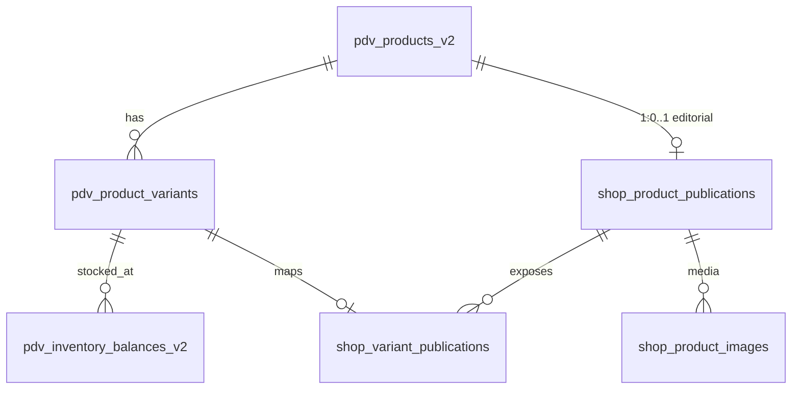

# Shop Fase 2.7 — DDL proposto + seed vazio + serviço read-only

**Data:** 2026-07-10  
**Status:** entregue, **sem migration aplicada**, **sem deploy**, **sem commit automático**

## Objetivo

Preparar a camada SQL/editorial do shop integrada ao CRM/PDV, mantendo o catálogo público live no JSON piloto.

## Arquitetura aprovada

| Camada | Papel |
|--------|--------|
| `pdv_products_v2` | Produto pai — nome, tipo, status, preço base |
| `pdv_product_variants` | Grade — cor, tamanho, preço por variação, status |
| `pdv_inventory_balances_v2` | Estoque físico/reservado por loja (interno) |
| `shop_product_publications` | Gate editorial — slug, título, descrição, status web |
| `shop_variant_publications` | Gate por variação — preço público override, ocultar |
| `shop_product_images` | Fotos públicas editoriais |
| `shop_catalog_settings` | Singleton opcional — fulfillment, política de estoque |

**Regra:** CRM/PDV é fonte de verdade. Shop só controla publicação/editorial.

## Diagrama de relações



## Fluxo read-only (Fase 2.7)

```
PDV tables (existentes)
        │
        ▼
shopPublicationService.listPdvPublicationCandidates()
        │
        ├── JOIN opcional shop_product_publications (se tabela existir)
        ├── Agrega estoque → label in_stock | low_stock | out_of_stock
        └── publicationAdminDto (sanitiza campos internos)
        │
        ▼
Uso futuro: UI admin CRM (Fase 2.9+)
        ✗ NÃO alimenta /public-api/catalog (piloto JSON continua)
```

## Arquivos entregues

| Arquivo | Função |
|---------|--------|
| `modules/shop/database/shop-publication-ddl.sql` | DDL proposto — **não aplicado** |
| `modules/shop/config/shop-publication-seed.json` | Seed vazio + config inicial — **não aplicado** |
| `modules/shop/dto/publicationAdminDto.js` | DTO admin sanitizado |
| `modules/shop/services/shopPublicationService.js` | Serviço read-only de candidatos |
| `scripts/shop_publication_readonly_smoke.js` | Smoke do serviço + catálogo piloto intacto |
| `modules/shop/routes/shopAdminRoutes.js` | Stub documentado (rotas HTTP inativas) |

## Serviço read-only — contrato

### `listPdvPublicationCandidates({ q, page, limit })`

- Lista produtos PDV elegíveis como candidatos à publicação
- Retorna: nome, tipo, preço, status PDV, variações (cor/tamanho/preço), label de disponibilidade
- Se `shop_product_publications` existir: inclui `publication` + `publication_status`
- Metadados: `schema_ready`, `pilot_json_active`

### `getPdvPublicationCandidate(pdvProductRef)`

- Detalhe de um candidato por ID PDV interno (uso admin futuro)

### `listPublicationRecords({ limit })`

- Lista publicações SQL se schema aplicado; array vazio + mensagem se não

### Disponibilidade agregada

Política lida de `shop-settings.json` → `fulfillment`:

- `store_ids`: lojas consideradas para venda online
- `stock_policy`: `min_across_stores` (default) ou `sum_selected`
- `low_stock_threshold`: default 2

Label derivado de qty vendável agregada (nunca exposta):

| Condição | Label |
|----------|-------|
| sellable ≤ 0 | `out_of_stock` |
| sellable ≤ threshold | `low_stock` |
| sellable > threshold | `in_stock` |

## Segurança — campos proibidos

Nunca expor na camada admin read-only nem na API pública:

- SKU, barcode, base_sku
- cost_price_cents, margin
- tiny_id, legacy_ai_product_id
- available_qty, reserved_qty, physical_qty por loja
- attributes_json bruto (parse → cor/tamanho apenas)

Implementado em `FORBIDDEN_ADMIN_KEYS` + `assertNoForbiddenAdminKeys()`.

## Riscos e mitigações

| Risco | Mitigação |
|-------|-----------|
| Migration aplicada acidentalmente | DDL isolado em arquivo; sem runner automático |
| Catálogo live trocado antes da hora | `shopCatalogService` continua em `pilot-publications.json`; `use_pilot_json: true` |
| Vazamento de estoque real | Apenas labels agregados; qty nunca no DTO |
| Vazamento de IDs internos na API pública | Serviço não registrado em `/public-api/*` |
| Duplicar cadastro em JSON | Seed vazio; pilot só fallback temporário |
| FK inválida na migration | Revisar product_id/variant_id antes de INSERT editorial |

## Confirmações

- [x] Migration **não** aplicada no banco
- [x] Seed **não** aplicado no banco
- [x] Catálogo live continua lendo `pilot-publications.json`
- [x] Nenhum deploy realizado
- [x] Nenhum commit sem aprovação do usuário
- [x] PDV operacional, Argox, WhatsApp, cashback **não** alterados

## Validação

```bash
npm run check
node scripts/shop_public_security_smoke.js
node scripts/shop_publication_readonly_smoke.js
```

## Próximos passos (fora do escopo 2.7)

1. Aprovar e aplicar DDL manualmente (com backup)
2. Fase 2.8–2.9: UI admin CRM para publicar candidatos
3. Fase 3+: trocar `shopCatalogService` para SQL quando `use_pilot_json: false`
