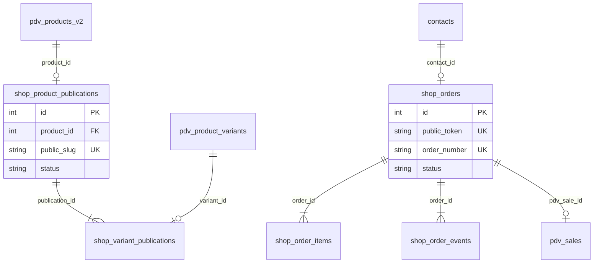

# Schema Design — E-commerce AEROSTORE

**Status:** Proposta para revisão — **não aplicar migrations até aprovação explícita**  
**Fase 2 atual:** catálogo usa `pilot-publications.json` como fonte temporária.

## Visão geral



---

## Fase 2 — Publicação (prioridade imediata pós-aprovação)

### shop_product_publications

Gate de publicação web. Produto só aparece no site se `status = 'published'` **e** produto PDV `status = 'ativo'`.

```sql
CREATE TABLE IF NOT EXISTS shop_product_publications (
  id INTEGER PRIMARY KEY AUTOINCREMENT,
  product_id INTEGER NOT NULL,
  public_slug TEXT NOT NULL COLLATE NOCASE UNIQUE,
  status TEXT NOT NULL DEFAULT 'draft'
    CHECK (status IN ('draft', 'published', 'archived')),
  public_title TEXT NOT NULL,
  public_description TEXT NOT NULL DEFAULT '',
  public_category_slug TEXT NOT NULL DEFAULT '',
  published_at TEXT,
  published_by TEXT NOT NULL DEFAULT '',
  unpublished_at TEXT,
  sort_order INTEGER NOT NULL DEFAULT 0,
  featured INTEGER NOT NULL DEFAULT 0 CHECK (featured IN (0, 1)),
  metadata_json TEXT NOT NULL DEFAULT '{}',
  created_at TEXT NOT NULL,
  updated_at TEXT NOT NULL,
  FOREIGN KEY (product_id) REFERENCES pdv_products_v2(id)
);

CREATE INDEX IF NOT EXISTS idx_shop_publications_status
  ON shop_product_publications(status, sort_order);
CREATE INDEX IF NOT EXISTS idx_shop_publications_category
  ON shop_product_publications(public_category_slug, status);
```

### shop_variant_publications

Controle por variação publicada.

```sql
CREATE TABLE IF NOT EXISTS shop_variant_publications (
  id INTEGER PRIMARY KEY AUTOINCREMENT,
  publication_id INTEGER NOT NULL,
  variant_id TEXT NOT NULL,
  public_variant_slug TEXT NOT NULL COLLATE NOCASE,
  status TEXT NOT NULL DEFAULT 'published'
    CHECK (status IN ('published', 'hidden')),
  public_price_cents INTEGER,
  max_online_qty INTEGER,
  created_at TEXT NOT NULL,
  updated_at TEXT NOT NULL,
  FOREIGN KEY (publication_id) REFERENCES shop_product_publications(id),
  FOREIGN KEY (variant_id) REFERENCES pdv_product_variants(id),
  UNIQUE (publication_id, variant_id),
  UNIQUE (publication_id, public_variant_slug)
);
```

### shop_catalog_settings

Config singleton (id=1).

```sql
CREATE TABLE IF NOT EXISTS shop_catalog_settings (
  id INTEGER PRIMARY KEY CHECK (id = 1),
  fulfillment_store_ids_json TEXT NOT NULL DEFAULT '[]',
  stock_policy TEXT NOT NULL DEFAULT 'min_across_stores'
    CHECK (stock_policy IN ('min_across_stores', 'sum_selected', 'dedicated_online_store')),
  reservation_ttl_minutes INTEGER NOT NULL DEFAULT 30,
  low_stock_threshold INTEGER NOT NULL DEFAULT 2,
  updated_at TEXT NOT NULL,
  updated_by TEXT NOT NULL DEFAULT ''
);
```

---

## Fase 4 — Leads

### shop_interest_leads

```sql
CREATE TABLE IF NOT EXISTS shop_interest_leads (
  id INTEGER PRIMARY KEY AUTOINCREMENT,
  product_slug TEXT NOT NULL,
  variant_slug TEXT NOT NULL DEFAULT '',
  customer_name TEXT NOT NULL DEFAULT '',
  customer_phone TEXT NOT NULL DEFAULT '',
  channel TEXT NOT NULL DEFAULT 'web',
  metadata_json TEXT NOT NULL DEFAULT '{}',
  created_at TEXT NOT NULL
);
```

---

## Fase 6–7 — Pedidos

### shop_orders

Entidade de pedido online — **nunca** inserir em `sales.json`.

```sql
CREATE TABLE IF NOT EXISTS shop_orders (
  id INTEGER PRIMARY KEY AUTOINCREMENT,
  public_token TEXT NOT NULL UNIQUE,
  order_number TEXT NOT NULL UNIQUE,
  status TEXT NOT NULL DEFAULT 'draft'
    CHECK (status IN (
      'draft', 'pending', 'confirmed', 'reserved',
      'paid', 'fulfilled', 'cancelled', 'expired'
    )),
  contact_id INTEGER,
  customer_snapshot_json TEXT NOT NULL DEFAULT '{}',
  fulfillment_mode TEXT NOT NULL DEFAULT 'pickup'
    CHECK (fulfillment_mode IN ('pickup', 'delivery')),
  fulfillment_store_id TEXT NOT NULL DEFAULT '',
  subtotal_cents INTEGER NOT NULL DEFAULT 0,
  discount_cents INTEGER NOT NULL DEFAULT 0,
  total_cents INTEGER NOT NULL DEFAULT 0,
  payment_status TEXT NOT NULL DEFAULT 'none',
  payment_provider TEXT NOT NULL DEFAULT '',
  payment_reference TEXT NOT NULL DEFAULT '',
  pdv_sale_id TEXT,
  reservation_id TEXT,
  expires_at TEXT,
  source TEXT NOT NULL DEFAULT 'web'
    CHECK (source IN ('web', 'whatsapp_redirect')),
  created_at TEXT NOT NULL,
  updated_at TEXT NOT NULL,
  FOREIGN KEY (contact_id) REFERENCES contacts(id)
);

CREATE INDEX IF NOT EXISTS idx_shop_orders_status ON shop_orders(status, created_at);
CREATE INDEX IF NOT EXISTS idx_shop_orders_token ON shop_orders(public_token);
```

### shop_order_items

```sql
CREATE TABLE IF NOT EXISTS shop_order_items (
  id INTEGER PRIMARY KEY AUTOINCREMENT,
  order_id INTEGER NOT NULL,
  variant_id TEXT NOT NULL,
  public_slug_snapshot TEXT NOT NULL DEFAULT '',
  public_variant_slug_snapshot TEXT NOT NULL DEFAULT '',
  quantity INTEGER NOT NULL DEFAULT 1 CHECK (quantity > 0),
  unit_price_cents INTEGER NOT NULL DEFAULT 0,
  line_total_cents INTEGER NOT NULL DEFAULT 0,
  reservation_status TEXT NOT NULL DEFAULT 'none',
  created_at TEXT NOT NULL,
  FOREIGN KEY (order_id) REFERENCES shop_orders(id)
);
```

### shop_order_events

Auditoria event-sourced.

```sql
CREATE TABLE IF NOT EXISTS shop_order_events (
  id INTEGER PRIMARY KEY AUTOINCREMENT,
  order_id INTEGER NOT NULL,
  event_type TEXT NOT NULL,
  actor TEXT NOT NULL DEFAULT 'system',
  payload_json TEXT NOT NULL DEFAULT '{}',
  created_at TEXT NOT NULL,
  FOREIGN KEY (order_id) REFERENCES shop_orders(id)
);

CREATE INDEX IF NOT EXISTS idx_shop_order_events_order
  ON shop_order_events(order_id, created_at);
```

**Event types:** `created`, `customer_matched`, `stock_reserved`, `stock_released`, `payment_initiated`, `payment_confirmed`, `converted_to_pdv_sale`, `cancelled`, `whatsapp_interest`, `expired`.

---

## Integração com estoque existente

Reservas online usam `pdv_inventory_movements_v2` com:

- `origin = 'shop'`
- `reference_type = 'shop_order'`
- `reference_id = shop_orders.order_number`

**Não** reutilizar prefixo `RSV-*` das reservas PDV.

---

## Checklist de aprovação

- [ ] Equipe revisou campos e status enums
- [ ] Decisão de fulfillment documentada em `shop-settings.json`
- [ ] Backup do banco antes da migration
- [ ] Script de seed para migrar `pilot-publications.json` → SQL
- [ ] Smoke test pós-migration

## Migração Fase 2 → SQL

Quando aprovado:

1. Adicionar DDL em `db.js` (`initializeDatabase`)
2. Seed a partir de `modules/shop/config/pilot-publications.json`
3. Alterar `shopCatalogService` para ler SQL (fallback JSON desativado)
4. Remover flag `use_pilot_json` de `shop-settings.json`
