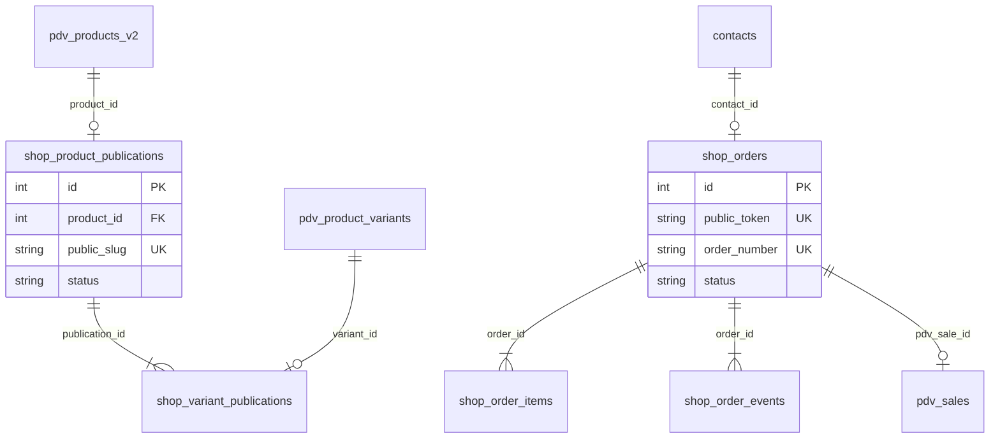
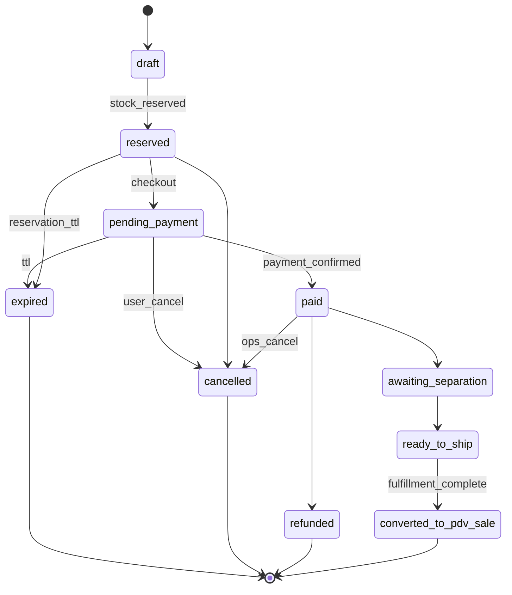

# Schema Design — E-commerce AEROSTORE

**Status:** Proposta para revisão — **não aplicar migrations até aprovação explícita**  
**Fase 2 atual:** catálogo usa `pilot-publications.json` como fonte temporária.  
**Atualizado:** 2026-07-11 — feedback arquitetural pré-Fase 2.9 (somente documentação).

## Princípio central — Publication Layer como espelho relacional

A futura camada `shop_*` **não duplica** dados base do produto que já vivem no CRM/PDV.

| Fonte da verdade (PDV/CRM) | Camada web (`shop_*`) |
|----------------------------|------------------------|
| `pdv_products_v2` — cadastro operacional | `product_id` (FK, chave relacional) |
| `pdv_product_variants` — SKU, barcode, cor, tamanho | `variant_id` (FK, quando aplicável) |
| `pdv_inventory_balances_v2` — saldo físico por loja | **não persistir** saldo na publicação |
| Preço base PDV | `public_price_cents` **somente se override web** |
| Nome interno PDV | `public_title` (nome editorial) |
| Custo, margem, Tiny ID, notas | **nunca** na camada shop |

**Regra:** `shop_product_publications` e `shop_variant_publications` guardam **apenas** metadados editoriais/de publicação. Qualquer leitura de estoque, SKU, barcode, custo ou margem **joina** ou consulta o PDV no momento da projeção — não copia para SQL shop.

Campos editoriais/de publicação previstos:

- `product_id`, `variant_id` (FKs)
- `public_slug`, `public_variant_slug`
- `status` / `status_publicacao` (`draft`, `published`, `archived`, `hidden`)
- `public_price_cents` (override web opcional; ausente = preço PDV)
- `public_title` (nome editorial)
- `public_description` (descrição editorial)
- `public_category_slug` (categoria web)
- fotos (`shop_product_images` ou JSON controlado)
- SEO (`metadata_json` ou colunas dedicadas)
- `sort_order`, `featured`

Referência de curadoria piloto: [shop-phase-2.8.3-pilot-selection.md](./shop-phase-2.8.3-pilot-selection.md).

## Visão geral



---

## Fase 2 — Publicação (prioridade imediata pós-aprovação)

### shop_product_publications

Gate de publicação web — **espelho editorial**, não cadastro de produto.

Produto só aparece no site se `status = 'published'` **e** produto PDV `status = 'ativo'`.

**Não armazenar aqui:** SKU, barcode, custo, margem, estoque numérico, nome PDV cru, IDs Tiny/legado. Esses campos vêm do PDV na projeção pública.

```sql
CREATE TABLE IF NOT EXISTS shop_product_publications (
  id INTEGER PRIMARY KEY AUTOINCREMENT,
  product_id INTEGER NOT NULL,
  public_slug TEXT NOT NULL COLLATE NOCASE UNIQUE,
  status TEXT NOT NULL DEFAULT 'draft'
    CHECK (status IN ('draft', 'published', 'archived')),
  public_title TEXT NOT NULL,
  public_description TEXT NOT NULL DEFAULT '',
  public_category_slug TEXT NOT NULL DEFAULT '',
  published_at TEXT,
  published_by TEXT NOT NULL DEFAULT '',
  unpublished_at TEXT,
  sort_order INTEGER NOT NULL DEFAULT 0,
  featured INTEGER NOT NULL DEFAULT 0 CHECK (featured IN (0, 1)),
  metadata_json TEXT NOT NULL DEFAULT '{}',
  created_at TEXT NOT NULL,
  updated_at TEXT NOT NULL,
  FOREIGN KEY (product_id) REFERENCES pdv_products_v2(id)
);

CREATE INDEX IF NOT EXISTS idx_shop_publications_status
  ON shop_product_publications(status, sort_order);
CREATE INDEX IF NOT EXISTS idx_shop_publications_category
  ON shop_product_publications(public_category_slug, status);
```

### shop_product_images (proposta)

Galeria editorial — URLs/caminhos públicos, alt text, ordem. Sem duplicar assets do PDV se houver fonte única futura.

```sql
CREATE TABLE IF NOT EXISTS shop_product_images (
  id INTEGER PRIMARY KEY AUTOINCREMENT,
  publication_id INTEGER NOT NULL,
  url TEXT NOT NULL,
  alt_text TEXT NOT NULL DEFAULT '',
  sort_order INTEGER NOT NULL DEFAULT 0,
  created_at TEXT NOT NULL,
  FOREIGN KEY (publication_id) REFERENCES shop_product_publications(id)
);

CREATE INDEX IF NOT EXISTS idx_shop_product_images_pub
  ON shop_product_images(publication_id, sort_order);
```

### shop_variant_publications

Controle por variação publicada — liga `variant_id` PDV a slug/preço override web.

```sql
CREATE TABLE IF NOT EXISTS shop_variant_publications (
  id INTEGER PRIMARY KEY AUTOINCREMENT,
  publication_id INTEGER NOT NULL,
  variant_id TEXT NOT NULL,
  public_variant_slug TEXT NOT NULL COLLATE NOCASE,
  status TEXT NOT NULL DEFAULT 'published'
    CHECK (status IN ('published', 'hidden')),
  public_price_cents INTEGER,
  max_online_qty INTEGER,
  created_at TEXT NOT NULL,
  updated_at TEXT NOT NULL,
  FOREIGN KEY (publication_id) REFERENCES shop_product_publications(id),
  FOREIGN KEY (variant_id) REFERENCES pdv_product_variants(id),
  UNIQUE (publication_id, variant_id),
  UNIQUE (publication_id, public_variant_slug)
);
```

### shop_catalog_settings

Config singleton (id=1).

```sql
CREATE TABLE IF NOT EXISTS shop_catalog_settings (
  id INTEGER PRIMARY KEY CHECK (id = 1),
  fulfillment_store_ids_json TEXT NOT NULL DEFAULT '[]',
  stock_policy TEXT NOT NULL DEFAULT 'min_across_stores'
    CHECK (stock_policy IN ('min_across_stores', 'sum_selected', 'dedicated_online_store')),
  reservation_ttl_minutes INTEGER NOT NULL DEFAULT 15,
  low_stock_threshold INTEGER NOT NULL DEFAULT 2,
  updated_at TEXT NOT NULL,
  updated_by TEXT NOT NULL DEFAULT ''
);
```

---

## Fase 4 — Leads

### shop_interest_leads

```sql
CREATE TABLE IF NOT EXISTS shop_interest_leads (
  id INTEGER PRIMARY KEY AUTOINCREMENT,
  product_slug TEXT NOT NULL,
  variant_slug TEXT NOT NULL DEFAULT '',
  customer_name TEXT NOT NULL DEFAULT '',
  customer_phone TEXT NOT NULL DEFAULT '',
  channel TEXT NOT NULL DEFAULT 'web',
  metadata_json TEXT NOT NULL DEFAULT '{}',
  created_at TEXT NOT NULL
);
```

---

## Fase 7 — Reserva de estoque (design; não implementar ainda)

### Objetivo

Garantir que disponibilidade online considere reservas ativas e evite corrida entre venda web e venda PDV física.

### shop_stock_reservations (proposta)

```sql
CREATE TABLE IF NOT EXISTS shop_stock_reservations (
  id INTEGER PRIMARY KEY AUTOINCREMENT,
  reservation_token TEXT NOT NULL UNIQUE,
  order_id INTEGER,
  variant_id TEXT NOT NULL,
  store_id TEXT NOT NULL DEFAULT '',
  quantity INTEGER NOT NULL CHECK (quantity > 0),
  status TEXT NOT NULL DEFAULT 'active'
    CHECK (status IN ('active', 'expired', 'released', 'consumed')),
  expires_at TEXT NOT NULL,
  consumed_at TEXT,
  released_at TEXT,
  created_at TEXT NOT NULL,
  updated_at TEXT NOT NULL,
  FOREIGN KEY (order_id) REFERENCES shop_orders(id),
  FOREIGN KEY (variant_id) REFERENCES pdv_product_variants(id)
);

CREATE INDEX IF NOT EXISTS idx_shop_reservations_active
  ON shop_stock_reservations(variant_id, store_id, status, expires_at);
CREATE INDEX IF NOT EXISTS idx_shop_reservations_order
  ON shop_stock_reservations(order_id);
```

### Regras de design

| Requisito | Abordagem |
|-----------|-----------|
| **Atomicidade** | Reserva criada em transação única com lock pessimista ou `UPDATE ... WHERE available >= qty` sobre saldo calculado |
| **TTL** | Default **15 minutos** (`shop_catalog_settings.reservation_ttl_minutes`); job/cron expira `active → expired` |
| **Status** | `active` → `consumed` (pedido pago/separado) ou `released` (cancelamento) ou `expired` (TTL) |
| **Disponibilidade online** | `available_online = physical_pool − sum(active reservations)` por `variant_id` (+ política de fulfillment) |
| **Anti-corrida PDV vs web** | Movimento de estoque com `origin='shop'`, `reference_type='shop_order'`; **decisão de negócio pendente** se reserva bloqueia PDV (ver abaixo) |

**Não reutilizar** prefixo `RSV-*` das reservas PDV internas. Pedidos shop usam `SHOP-*`.

### Decisão de negócio pendente — modelo de reserva

| Modelo | Comportamento | Riscos |
|--------|---------------|--------|
| **A — Reserva bloqueia PDV físico** | Unidade reservada online reduz saldo disponível também no PDV | Cliente na loja pode não encontrar peça “em estoque” no sistema; exige operação clara (“reservado para web”) |
| **B — Reserva só segura online; confirma na separação** | Web mostra disponibilidade conservadora; PDV vende livremente até separação/conferência | Overselling se loja vender última unidade antes da separação; exige política de cancelamento/reembolso |

**Status:** aguardando decisão do dono antes de implementar Fase 7.

---

## Fase 6–7 — Pedidos

### Máquina de estados — pedido online

Pedido online **não** vira venda PDV comum sem transição controlada (`converted_to_pdv_sale`).



| Estado | Significado |
|--------|-------------|
| `draft` | Carrinho/checkout iniciado, sem reserva |
| `reserved` | Estoque reservado (TTL ativo) |
| `pending_payment` | Aguardando pagamento |
| `paid` | Pagamento confirmado |
| `awaiting_separation` | Separação/conferência na loja |
| `ready_to_ship` | Pronto retirada/envio |
| `converted_to_pdv_sale` | Convertido em venda PDV via fluxo dedicado (não insert direto em `sales.json`) |
| `cancelled` | Cancelado |
| `expired` | Reserva ou checkout expirou |
| `refunded` | Estorno pós-pagamento |

Transição `converted_to_pdv_sale` exige: `shop_order_events` + vínculo `pdv_sale_id` + liberação/consumo de reserva coerente.

### shop_orders

Entidade de pedido online — **nunca** inserir em `sales.json`.

```sql
CREATE TABLE IF NOT EXISTS shop_orders (
  id INTEGER PRIMARY KEY AUTOINCREMENT,
  public_token TEXT NOT NULL UNIQUE,
  order_number TEXT NOT NULL UNIQUE,
  status TEXT NOT NULL DEFAULT 'draft'
    CHECK (status IN (
      'draft', 'reserved', 'pending_payment', 'paid',
      'awaiting_separation', 'ready_to_ship', 'converted_to_pdv_sale',
      'cancelled', 'expired', 'refunded'
    )),
  contact_id INTEGER,
  customer_snapshot_json TEXT NOT NULL DEFAULT '{}',
  fulfillment_mode TEXT NOT NULL DEFAULT 'pickup'
    CHECK (fulfillment_mode IN ('pickup', 'delivery')),
  fulfillment_store_id TEXT NOT NULL DEFAULT '',
  subtotal_cents INTEGER NOT NULL DEFAULT 0,
  discount_cents INTEGER NOT NULL DEFAULT 0,
  total_cents INTEGER NOT NULL DEFAULT 0,
  payment_status TEXT NOT NULL DEFAULT 'none',
  payment_provider TEXT NOT NULL DEFAULT '',
  payment_reference TEXT NOT NULL DEFAULT '',
  pdv_sale_id TEXT,
  reservation_id TEXT,
  expires_at TEXT,
  source TEXT NOT NULL DEFAULT 'web'
    CHECK (source IN ('web', 'whatsapp_redirect')),
  created_at TEXT NOT NULL,
  updated_at TEXT NOT NULL,
  FOREIGN KEY (contact_id) REFERENCES contacts(id)
);

CREATE INDEX IF NOT EXISTS idx_shop_orders_status ON shop_orders(status, created_at);
CREATE INDEX IF NOT EXISTS idx_shop_orders_token ON shop_orders(public_token);
```

### shop_order_items

```sql
CREATE TABLE IF NOT EXISTS shop_order_items (
  id INTEGER PRIMARY KEY AUTOINCREMENT,
  order_id INTEGER NOT NULL,
  variant_id TEXT NOT NULL,
  public_slug_snapshot TEXT NOT NULL DEFAULT '',
  public_variant_slug_snapshot TEXT NOT NULL DEFAULT '',
  quantity INTEGER NOT NULL DEFAULT 1 CHECK (quantity > 0),
  unit_price_cents INTEGER NOT NULL DEFAULT 0,
  line_total_cents INTEGER NOT NULL DEFAULT 0,
  reservation_status TEXT NOT NULL DEFAULT 'none',
  created_at TEXT NOT NULL,
  FOREIGN KEY (order_id) REFERENCES shop_orders(id)
);
```

### shop_order_events

Auditoria event-sourced.

```sql
CREATE TABLE IF NOT EXISTS shop_order_events (
  id INTEGER PRIMARY KEY AUTOINCREMENT,
  order_id INTEGER NOT NULL,
  event_type TEXT NOT NULL,
  actor TEXT NOT NULL DEFAULT 'system',
  payload_json TEXT NOT NULL DEFAULT '{}',
  created_at TEXT NOT NULL,
  FOREIGN KEY (order_id) REFERENCES shop_orders(id)
);

CREATE INDEX IF NOT EXISTS idx_shop_order_events_order
  ON shop_order_events(order_id, created_at);
```

**Event types:** `created`, `customer_matched`, `customer_deduped`, `stock_reserved`, `stock_released`, `stock_consumed`, `reservation_expired`, `payment_initiated`, `payment_confirmed`, `awaiting_separation`, `ready_to_ship`, `converted_to_pdv_sale`, `cancelled`, `refunded`, `whatsapp_interest`, `expired`.

---

## Fase 6+ — Deduplicação cliente site → CRM (design)

Evitar criar `contacts` duplicados em massa no checkout.

### Chaves de matching (ordem de força)

| Prioridade | Chave | Força | Uso |
|------------|-------|-------|-----|
| 1 | CPF normalizado (11 dígitos) | **Forte** | Match determinístico; merge se único |
| 2 | Telefone normalizado (E.164 / BR) | **Forte/média** | WhatsApp + checkout; cuidado com família/compartilhado |
| 3 | E-mail normalizado (lowercase, trim) | **Média** | Match provável; confirmar se ambíguo |
| 4 | Nome + telefone | **Fallback** | Sugestão para revisão manual, não auto-merge automático |

### Regras

- Checkout cria **snapshot** em `customer_snapshot_json`; match tenta vincular `contact_id` existente.
- Auto-merge só com chave **forte** única; demais casos → fila de revisão CRM ou `contact_id` provisório + evento `customer_deduped`.
- Novo contato: `source = 'ecommerce'`, campos mínimos; enriquecimento posterior no CRM.
- **Nunca** sobrescrever dados CRM com snapshot web sem auditoria.

Tabela auxiliar futura (opcional): `shop_customer_match_log` para auditoria de merges.

---

## Integração com estoque existente

Reservas online usam `pdv_inventory_movements_v2` com:

- `origin = 'shop'`
- `reference_type = 'shop_order'`
- `reference_id = shop_orders.order_number`

**Não** reutilizar prefixo `RSV-*` das reservas PDV.

---

## Checklist de aprovação

- [ ] Equipe revisou campos e status enums
- [ ] **Decisão dono:** modelo de reserva A (bloqueia PDV) vs B (só online até separação)
- [ ] Decisão de fulfillment documentada em `shop-settings.json`
- [ ] Publication layer validada como espelho (sem duplicar SKU/estoque/custo)
- [ ] State machine de pedido aprovada
- [ ] Estratégia dedup cliente aprovada
- [ ] Backup do banco antes da migration
- [ ] Script de seed para migrar intake piloto (8 produtos Grupo A) → SQL
- [ ] Smoke test pós-migration

## Migração Fase 2 → SQL

Quando aprovado:

1. Adicionar DDL em `db.js` (`initializeDatabase`)
2. Seed a partir de `modules/shop/config/pilot-publications.json`
3. Alterar `shopCatalogService` para ler SQL (fallback JSON desativado)
4. Remover flag `use_pilot_json` de `shop-settings.json`
